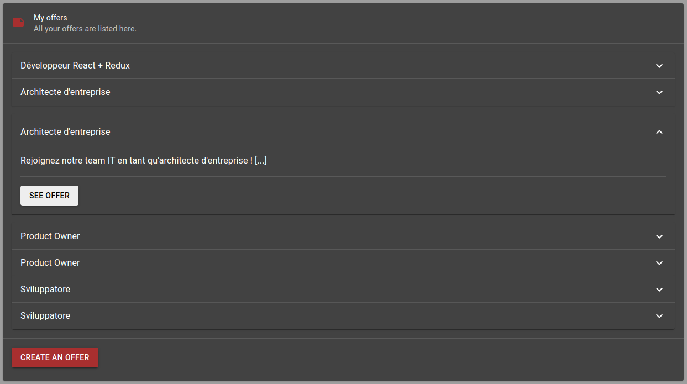

# Profile and offers frontend

## Presentation

This frontend allows someone to register himself in order to create offers for IT jobs. An unregistered user can have a list of offers, filtered by their city names.

## Technical stack

This service is built on React. The stack relies on :
- [Redux](https://redux.js.org/): allows to add different states to an application
- [Typescript](https://www.typescriptlang.org/): allows to have a full control on the variables, by typing them
- [Material UI](https://material-ui.com/): a proper framework to create cool and Google-like applications

## Development

### `npm install`

### `npm start`

Application runs on port 3006.

## Views of project

Here are different views of the project.

### View of a list of offers

### View of my offers

### View of an offer, as creator

